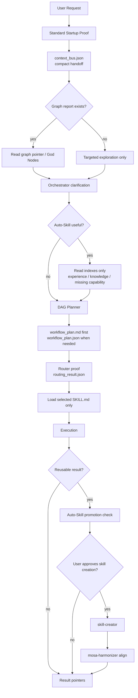

# MOSA Audit And Token Efficiency Report

Generated: 2026-06-06

## Executive Summary

MOSA is currently healthy as a Codex-local orchestration layer. The runtime has only two modes: `standard` and `cold-repair`. Standard mode remains token-light because it relies on compact proof files, graph pointers, DAG summaries, lightweight routing indexes, and selected skill loading after Router proof.

Overall score: 8.7 / 10

## Verification

| Check | Result |
| --- | --- |
| `node 00_System/mosa_cli.js check` | ok |
| `node 00_System/mosa_cli.js test` | ok |
| `node 00_System/mosa_cli.js align --write` | ok |
| Runtime modes | `standard`, `cold-repair` |
| Legacy mode map | `micro`, `full`, `maintenance` -> `standard` |
| DAG node deliverables | supported |
| Deprecated route authorities | blocked |

## Current Sample Artifact Sizes

Sample intent:

```text
plan an overseas alumni dinner event with venue, RSVP, promotion, budget, dinner agenda, onsite operations, and follow-up
```

| Artifact | Bytes | Estimated Tokens |
| --- | ---: | ---: |
| `01_Work/startup_result.json` | 2,067 | ~517 |
| `01_Work/context_bus.json` | 1,153 | ~289 |
| `01_Work/workflow_plan.json` | 6,009 | ~1,503 |
| `01_Work/workflow_plan.md` | 1,218 | ~305 |
| `01_Work/routing_result.json` | 8,209 | ~2,053 |
| `02_Output/mosa_alignment_report.json` | 1,055 | ~264 |

## Token Guidance

| Scenario | Recommended Read | Estimated Tokens |
| --- | --- | ---: |
| Normal startup | `startup_result.json` + `context_bus.json` | ~800-1,500 |
| Startup with graph context | plus `graphify-out/GRAPH_REPORT.md` pointer read | ~1,200-2,200 |
| Planning review | `workflow_plan.md` first | ~300-800 |
| Full DAG inspection | `workflow_plan.json` | ~1,500-3,000 |
| Router proof inspection | `routing_result.json` | ~2,000-4,000 |
| Alignment audit | `mosa_alignment_report.json` | ~250-600 |
| Cold diagnostics | registry reports only when needed | cold read |

Important distinction:

- `available_hot_artifact_token_estimate` means all hot artifacts if fully read.
- `expected_startup_read_tokens` means the recommended actual startup read.

Current startup output recommends:

```text
normal: 800-1500
with_graph_pointer: 1200-2200
```

## Efficiency Flow



## Role Audit

| Component | Current Role | Audit Result |
| --- | --- | --- |
| `mosa-graph-builder` | Workspace topology and God Nodes | Healthy; discovery-only boundary is clear |
| `orchestrator-agent` | Clarification and task shape | Healthy; Router no longer decomposes tasks |
| `auto-skill` | Key notes, experience, promotion, missing capability memory | Improved; real memory index files now exist |
| DAG planner | Capability graph and deliverables | Improved; node-level deliverables added without top-level schema bloat |
| `router-agent` | Skill selection proof | Healthy; returns selected skill paths after DAG hints |
| `mosa-harmonizer` | Drift and protocol alignment | Improved; `align --write` now produces compact report |
| `skill-creator` | Approved skill creation or improvement | Improved; Codex-native and concise |

## Findings

1. No blocking issues found.
2. The largest routine artifacts are `routing_result.json` and `workflow_plan.json`, but users should usually read `workflow_plan.md` first.
3. Auto-Skill memory is structurally ready, but its value depends on accumulating real experience entries over time.
4. DAG planner is intentionally compact. It should not become a full production workflow engine.
5. Registry diagnostics should remain cold reads.

## Recommendations

- Prefer `workflow_plan.md` for human review.
- Read full `workflow_plan.json` only when Router or audit needs exact node fields.
- Keep `mosa_alignment_report.json` as the first harmonizer read.
- Start recording real Auto-Skill experience only after user approval or repeated capability gaps.
- Keep `skill-creator` approval-gated.

## Bottom Line

MOSA is now efficient because it uses standard mode without loading everything. The savings come from compact evidence, graph pointers, selected reads, and skill loading after proof rather than from skipping orchestration entirely.
