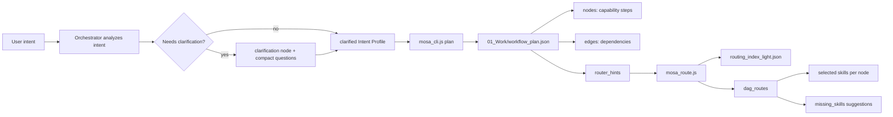

# MOSA DAG Routing Flow



## Example Capability DAG

For `build a data dashboard`:

```text
planning -> data -> review
time: planning -> design -> review
time: planning -> coding -> review
parallel: data + design + coding
```

The Router does not create this graph. It only reads `router_hints` and maps each capability node to candidate skills.

For `plan an overseas alumni dinner event`, the graph should include event-specific capability nodes such as clarification, goal/scope, budget, venue/catering, RSVP, promotion, agenda, onsite operations, risk control, follow-up, and review. These nodes are produced before Router dispatch, so Router is not forced to infer the event plan from isolated keywords.

## Why This Saves Tokens

- The planner stores capability nodes, not full SOPs.
- Router reads lightweight skill indexes, not full skill bodies.
- Full `SKILL.md` loads only after a concrete route is selected.
- Missing skills are suggestions, not failures or auto-created files.
