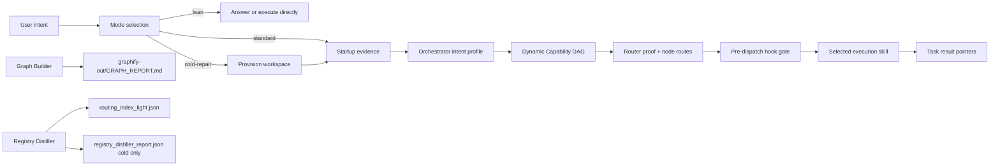

# MOSA Framework

MOSA is a lightweight coordination framework for AI coding sessions. It helps a new chat recover project state, choose the right skill, and avoid rereading large registries or full skill files.

The current public protocol is **MOSA v3.5**. Its main change is simple: MOSA should not run every layer for every task.

## What Changed In v3.5

MOSA now uses proportional activation:

| Mode | Use when | Skips |
| --- | --- | --- |
| `lean` | Simple Q&A, direct checks, tiny obvious edits | startup, Router, hooks, task-state writes |
| `standard` | Multi-step work, file changes, MOSA/skill/routing/graph/hook/registry/audit work | full registry diagnostics |
| `cold-repair` | New or damaged workspace; startup or Router proof missing/stale | broad model-side registry reads |

This keeps the framework useful without turning every request into a ceremony.

## Core Principle

MOSA should make the next AI session cheaper, not heavier.

It does this by separating hot, warm, and cold data:

- **Hot proof**: small JSON files the model can read safely.
- **Warm indexes**: Node tools read them for routing; the model should not open them by default.
- **Cold diagnostics**: full registry reports and audit files, opened only when repair or audit requires them.

## Architecture



## Workspace Layout

| Path | Purpose |
| --- | --- |
| `AGENTS.md` | Canonical MOSA v3.5 protocol |
| `graphify-out/GRAPH_REPORT.md` | Compact topology and God Nodes |
| `00_System/state.json` | Turn count and drift threshold |
| `00_System/prompt_stack.md` | Durable framework memory |
| `00_System/routing_cache.json` | High-confidence route cache |
| `00_System/mosa_startup.js` | Writes compact startup proof |
| `00_System/mosa_route.js` | Official Router proof wrapper |
| `00_System/mosa_cli.js` | Compatibility CLI, health checks, Dynamic Capability DAG planner |
| `00_System/mosa_provision_workspace.js` | Cold-repair provisioner |
| `00_System/mosa_hooks.js` | Event-triggered trust gates |
| `01_Work/context_bus.json` | Current-task compact handoff |
| `01_Work/startup_result.json` | Startup proof |
| `01_Work/routing_result.json` | Router proof |
| `01_Work/workflow_plan.json` | Dynamic Capability DAG for cross-skill work |
| `01_Work/task.md` | Standard/cold task plan |
| `01_Work/task_results.md` | Result pointers |
| `02_Output/startup_manifest.json` | Startup pointer manifest |
| `02_Output/routing_index_light.json` | Warm Router index |
| `02_Output/reference_map_light.json` | Lightweight reference map |
| `02_Output/active_skill_index.json` | Larger fallback skill index |
| `02_Output/registry_distiller_report.json` | Cold diagnostics only |
| `skills/` | Public MOSA core skills |

## Core Skills

| Skill | Role |
| --- | --- |
| `skills/orchestrator-agent/SKILL.md` | Mode selection, intent profile, Router coordination, dispatch |
| `skills/router-agent/SKILL.md` | Explainable skill routing with proof and fallback codes |
| `skills/base-distiller/SKILL.md` | Registry diagnostics and routing artifact generation |
| `skills/mosa-graph-builder/SKILL.md` | Graph topology and Token Shield pointers |
| `skills/mosa-harmonizer/SKILL.md` | Protocol alignment, drift repair, durable framework memory |

## Startup Modes

### Lean

Use Lean Mode for simple work:

- answer-only questions
- direct terminal checks
- tiny obvious edits
- one-step requests where the needed skill is already obvious

Lean Mode should not create or append MOSA task artifacts.

### Standard

Use Standard Mode when proof, routing, or persistence adds value:

- multi-step work
- file-changing tasks
- ambiguous or cross-skill work
- MOSA, skill, routing, hook, registry, graph, or audit changes
- work that benefits from resumability

Standard path:

```text
Workspace Root
-> Startup Evidence
-> Intent Profile
-> Router Proof
-> Pre-dispatch Hook Gate when triggered
-> Selected Skill
-> Result Pointers
```

### Cold-Repair

Use Cold-repair Mode only when evidence is missing or untrusted:

- no `00_System`
- missing `mosa_startup.js` or `mosa_route.js`
- missing `startup_result.json` or `routing_result.json`
- reconstructed or stale Router proof
- missing light routing artifacts with low confidence

Provision command:

```bash
node 00_System/mosa_provision_workspace.js --target "<workspace>" --run --intent "<task intent>"
```

Provision output is compact by default. Use `--verbose` only when nested startup and route JSON is needed for debugging:

```bash
node 00_System/mosa_provision_workspace.js --target "<workspace>" --run --verbose --intent "<task intent>"
```

## Router Proof

`00_System/mosa_route.js` is the official Router proof generator.

Valid proof is written to:

```text
01_Work/routing_result.json
```

Required proof fields:

- `schema_version`
- `status`
- `source`
- `created_at`
- `intent_hash`
- `input`
- `top_skill`
- `candidates`
- `fallback_code`
- `fallback_recommendation`
- `validation`

`skills/router-agent/mosa_search.js` is the internal search engine or emergency fallback. It is not the official proof wrapper by itself.

## Dynamic Capability DAG

For cross-skill work, MOSA can generate a dynamic capability graph before Router dispatch:

```bash
node 00_System/mosa_cli.js plan --intent "<user intent>" --write
```

This writes:

```text
01_Work/workflow_plan.json
01_Work/workflow_plan.md
```

The planner infers capabilities from the goal instead of using rigid workflow templates. A task such as building a website, preparing an event, creating a dashboard, writing a report, or automating a process produces a different DAG based on needed capabilities.

Router can consume the DAG:

```bash
node 00_System/mosa_route.js --intent "<user intent>" --workflow-plan "01_Work/workflow_plan.json"
```

When a workflow plan is supplied, `routing_result.json` also includes:

- `workflow_plan_id`
- `node_routes`
- `collaboration_order`
- `missing_skill_suggestions`

Missing capabilities become skill-growth suggestions. MOSA does not auto-create new skills unless the user explicitly approves that action.

## Confidence Tiers

| Tier | Confidence | Behavior |
| --- | ---: | --- |
| `strong` | `>= 0.80` | Auto-dispatch allowed after proof validation |
| `medium` | `0.50-0.79` | Orchestrator review before dispatch |
| `weak` | `0.35-0.49` | Do not auto-dispatch |
| `fail` | `< 0.35` | Reroute, clarify, or run diagnostics |

Fallback codes include:

- `LOW_CONFIDENCE`
- `WEAK_CONFIDENCE`
- `NO_CANDIDATE`
- `MISSING_INDEX`
- `STALE_CACHE`
- `INVALID_SKILL_PATH`
- `ROUTER_ERROR`

## Token Strategy

Normal model-visible startup after v3.5 should stay compact:

| Artifact | Approx tokens | Exposure |
| --- | ---: | --- |
| `01_Work/startup_result.json` | ~300 | Model reads |
| `01_Work/context_bus.json` | ~200 | Model reads |
| `01_Work/routing_result.json` | ~700 | Model reads |
| `02_Output/startup_manifest.json` | ~500 | Optional pointer |
| `02_Output/routing_index_light.json` | ~4,500 | Node reads |
| `02_Output/active_skill_index.json` | ~10,000+ | Fallback only |
| `02_Output/registry_distiller_report.json` | ~70,000+ | Cold diagnostics only |

The key rule:

```text
Node reads indexes and cache.
The model reads compact proof and pointers.
```

## Event-Triggered Hooks

Hooks are not mandatory for routine work.

Default routine check:

```bash
node 00_System/mosa_hooks.js --level auto --event normal-task
```

Event mapping:

| Event | Level |
| --- | --- |
| `normal-task` | skip |
| `startup-evidence` | P0 |
| `router-proof` | P0 |
| `dangerous-command` | P0 |
| `protocol-update` | P1 |
| `agents-update` | P1 |
| `skill-update` | P1 |
| `registry-update` | P1 |
| `routing-index-update` | P1 |
| `framework-update` | P2 |
| `trust-framework-update` | P2 |
| `smoke-test` | P2 |

P2 is required before trusting framework updates.

## Registry Distiller

Registry Distiller is read-only by default. It should generate diagnostics and routing artifacts, not mutate registries without explicit approval.

Common outputs:

| Temperature | File | Usage |
| --- | --- | --- |
| Hot | `startup_manifest.json` | startup pointer |
| Warm | `routing_index_light.json` | normal Router input |
| Warm | `reference_map_light.json` | reference redirects |
| Warm | `active_skill_index.json` | fuller route fallback |
| Cold | `registry_distiller_report.json` | audit evidence only |

## Graph Builder

Graph Builder should be used when topology actually matters:

- new project map
- large or unfamiliar workspace
- architecture/dependency questions
- missing or stale `graphify-out/GRAPH_REPORT.md`

It should not run for simple answer-only tasks.

## Harmonizer

Harmonizer aligns the framework itself:

- AGENTS protocol
- core skills
- Node tools
- routing artifacts
- hook policy
- graph topology
- prompt stack memory

It should not execute ordinary business tasks.

## CLI Compatibility

The repository still includes `00_System/mosa_cli.js` as a convenience and compatibility layer.

Useful commands:

```bash
node 00_System/mosa_cli.js check
node 00_System/mosa_cli.js start --mode ask --intent "<user intent>"
node 00_System/mosa_cli.js plan --intent "<user intent>" --write
node 00_System/mosa_cli.js route --intent "<user intent>" --write
node 00_System/mosa_cli.js test
node 00_System/mosa_cli.js dag
node 00_System/mosa_cli.js maintain --write
node 00_System/mosa_cli.js context --fact key --value value
```

The v3.5 protocol is authoritative for new behavior. The CLI remains useful for health checks, compatibility startup packets, and maintenance commands.

## When MOSA Is Worth It

Use MOSA when the work benefits from:

- proof
- routing
- resumability
- auditability
- graph context
- cross-skill coordination

Avoid full MOSA activation for:

- one-line answers
- simple explanations
- tiny obvious edits
- direct status checks

## Design Principle

Every MOSA artifact must earn its place by reducing rediscovery, routing ambiguity, context drift, or audit cost.

If an artifact does not do that, keep it out of the startup path.
