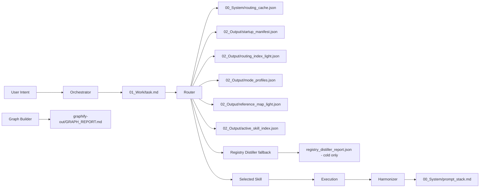

# MOSA Framework

MOSA is a project startup and skill-routing framework for working with AI agents across different projects, tools, and chat sessions. Its main goal is simple: each new AI session should recover the project state quickly, route to the right skill, and avoid rereading the whole workspace or the whole skill registry.

MOSA is not meant to replace the coding agent. It is a lightweight coordination layer around the agent.

## Core Idea

Most AI project work wastes tokens in three places:

- rediscovering the same project structure
- rereading large skill files or registry reports
- letting every agent reinterpret the user request differently

MOSA solves this by separating responsibilities:

- **Orchestrator** understands the user's intent.
- **Router** selects the right skill.
- **Graph Builder** gives the project map.
- **Registry Distiller** keeps the skill registry healthy.
- **Harmonizer** records durable project memory and audits drift.

The framework is pointer-first. It stores paths, summaries, health signals, and routing hints. Full reports and full skill files are treated as cold data.

## Current Architecture



## Workspace Layout

| Path | Purpose |
|---|---|
| `AGENTS.md` | Token Shield instructions for future AI sessions |
| `graphify-out/GRAPH_REPORT.md` | Compact workspace topology and God Nodes |
| `00_System/state.json` | Turn count and drift threshold |
| `00_System/prompt_stack.md` | Durable project memory |
| `00_System/routing_cache.json` | High-confidence route cache |
| `00_System/MOSA_PROJECT_STARTUP_PROTOCOL.md` | Startup protocol |
| `01_Work/task.md` | Active task, atomic keywords, intent profile |
| `01_Work/session_state.json` | Temporary pointer-only state |
| `01_Work/context_bus.json` | Current-task shared facts and cross-agent handoff |
| `01_Work/task_results.md` | Latest task result pointers |
| `02_Output/startup_manifest.json` | Hot startup manifest |
| `02_Output/routing_index_light.json` | Warm lightweight Router index |
| `02_Output/reference_map_light.json` | Lightweight reference-to-master map |
| `02_Output/active_skill_index.json` | Fuller active skill index |
| `02_Output/registry_distiller_report.json` | Cold full diagnostics |

## Startup Flow

The cheapest startup path is the coded startup packet:

```bash
node 00_System/mosa_cli.js start --mode ask --intent "<user intent>"
```

The CLI first checks required files and JSON health, then calls the lightweight startup script. If startup fails, it returns a safe `micro` fallback packet instead of breaking the workflow.

Direct startup still works:

```bash
node 00_System/mosa_startup.js --mode ask --intent "<user intent>"
```

The startup packet returns a compact graph summary, recent memory, current task, context bus status, health, and escalation advice. If the task is ambiguous, it returns `mode: ask` with a recommended mode and a short question. This is the preferred entry point for normal new chats because it avoids making the LLM read every startup file directly.

For a new chat or resumed project, read in this order:

1. `AGENTS.md`
2. `02_Output/startup_manifest.json`
3. `graphify-out/GRAPH_REPORT.md`
4. `00_System/prompt_stack.md`
5. `01_Work/task.md`
6. `02_Output/routing_index_light.json` if skill routing is needed
7. `02_Output/mode_profiles.json` and `02_Output/reference_map_light.json` for disambiguation
8. `02_Output/active_skill_index.json` only if light routing is not enough
9. Full skill files only when exact SOP details are needed

Do not read `02_Output/registry_distiller_report.json` during normal startup.

## Lightweight Startup Modes

| Mode | Trigger | Expected cost | Action |
|---|---|---:|---|
| `ask` | Ambiguous task | ~1,000 tokens | Ask user to choose |
| `micro` | Simple question, same-project small edit | ~500-1,500 tokens | Use LLM and relevant files |
| `standard` | New project or likely skill selection | ~1,500-5,000 tokens | Add light routing |
| `full` | Long implementation, architecture, multi-agent work | ~6,000-12,000 tokens | Use full Orchestrator + Router |
| `maintenance` | Registry, framework, drift, token audit | task-dependent | Use Harmonizer or Distiller |

The goal is proportional activation. MOSA should not run every layer for a small question.

Mode policy:

- Explicit user mode always wins.
- Use `micro` for obvious small tasks.
- Use `standard` for new project context or likely skill selection.
- Use `full` only for long implementation, architecture, or multi-agent work.
- Use `maintenance` for MOSA, registry, skill, token, or drift audits.
- Use `ask` when the choice is unclear.

## Core Tools

### MOSA CLI

`00_System/mosa_cli.js` is the solo-developer safety layer. It keeps the framework useful even when an index or JSON file is broken.

Common commands:

```bash
node 00_System/mosa_cli.js check
node 00_System/mosa_cli.js start --mode ask --intent "<user intent>"
node 00_System/mosa_cli.js route --intent "<user intent>" --write
node 00_System/mosa_cli.js test
node 00_System/mosa_cli.js context --fact key --value value
```

What it solves:

- validates required files and JSON before startup
- falls back to safe `micro` mode when startup breaks
- gives route reasons and writes `02_Output/last_route_decision.md`
- runs golden route tests without a full testing framework
- updates `context_bus.json` with atomic write-and-rename

This is intentionally dependency-free Node.js. No npm install is required.

### Orchestrator

The Orchestrator is the task brain. It converts the user's request into structured routing input.

Responsibilities:

- initialize the MOSA workspace
- read graph context when available
- extract Atomic Keywords
- generate an Intent Profile
- write `01_Work/task.md`
- call Router with structured input
- handle low-confidence routing
- trigger Distiller or user confirmation when needed
- dispatch the selected execution skill
- trigger audit, GC, and memory updates

Router should not redo this work. This boundary is important because repeated intent decomposition is one of the main sources of token waste and inconsistent behavior.

Example Intent Profile:

```json
{
  "intent_summary": "Build a Google Apps Script web app with sheet cache and quota protection",
  "atomic_keywords": [
    "google apps script",
    "web app",
    "sheet cache",
    "quota protection"
  ],
  "preferred_domain": "gas",
  "required_capability": "route to best GAS project startup skills",
  "exclusions": []
}
```

### Router

The Router is a retrieval and scoring layer. It does not perform business logic and does not redesign the task.

Responsibilities:

- read `routing_cache.json`
- read `routing_index_light.json` by default
- apply mode boosts from `mode_profiles.json`
- redirect references through `reference_map_light.json`
- return Top 3 skill candidates
- include confidence and match reasons
- recommend fallback when confidence is low

Normal routing should come from `routing_index_light.json`. The Router hydrates selected result paths from the registry only after scoring, so it avoids loading full skill files during normal search.

Example route:

```text
Query: google apps script web app sheet cache quota
Top 3:
- GAS_WEBAPP_ARCHITECT
- GOOGLE_AGENT
- UTAR_OPS
Source: routing_index_light
```

### Registry Distiller

Registry Distiller is the registry maintenance tool. Its default role is read-only diagnostics and artifact generation.

Responsibilities:

- verify registered skill files exist
- detect missing files
- detect orphan skill folders
- detect tag collisions
- normalize tags and aliases
- generate routing artifacts
- generate token budget reports

Distiller outputs are split by temperature:

| Temperature | File | Usage |
|---|---|---|
| Hot | `startup_manifest.json` | startup pointer |
| Warm | `routing_index_light.json` | normal Router input |
| Warm | `reference_map_light.json` | reference redirects |
| Warm | `active_skill_index.json` | fuller route fallback |
| Cold | `registry_distiller_report.json` | audit evidence only |

The full JSON report is intentionally cold. It currently costs about 69K tokens if read directly, so it must not be part of normal startup.

### Context Bus

Context Bus is the current-task shared workspace for multiple agents. It is not a router index and not long-term memory.

Responsibilities:

- store shared facts needed by more than one agent
- store short summaries of each agent's output
- pass handoff requirements to the next agent
- keep confidence, pointers, and key outputs machine-readable
- reduce repeated rereading between agents

Use it for flows such as:

```text
PROJECT_PLANNER -> MARKETING_IDEAS -> SOCIAL_POST_WRITER_SEO
```

Recommended structure:

```json
{
  "_meta": {
    "version": "1.1",
    "lifecycle": "ephemeral",
    "max_tokens": 2000
  },
  "shared_facts": {},
  "agent_outputs": {},
  "handoff": {
    "next_agent": null,
    "needed_inputs": []
  },
  "gc_policy": {
    "clear_after_task": true,
    "promote_to_prompt_stack": false
  }
}
```

Context Bus should stay small. Store summaries and pointers, not full drafts or source files. At task completion, Harmonizer may promote a short durable summary to `prompt_stack.md`, then clear the bus.

### Graph Builder

Graph Builder creates the workspace topology and Token Shield.

Responsibilities:

- generate `graphify-out/GRAPH_REPORT.md`
- identify God Nodes
- update startup pointers
- keep graph context compact
- support project startup for new workspaces
- prevent broad scans when a graph already exists

The graph report is the first structural map. Its job is not to document every file. Its job is to bound the search space.

### Harmonizer

Harmonizer is the framework maintenance and memory layer.

Responsibilities:

- audit framework alignment
- check workspace structure
- detect routing/index drift
- record durable decisions in `prompt_stack.md`
- maintain cleanup backlogs
- consolidate repeated skill families
- run maintenance when drift threshold is reached

Harmonizer should not handle normal business execution. It is used when the framework itself needs alignment or when important experience should be preserved.

## Skill Routing Model

MOSA uses master/reference/specialized routing.

| Type | Meaning | Router behavior |
|---|---|---|
| Active | Main routable skill | Can appear in Top 3 |
| Reference | Duplicate or supporting skill | Redirects to master |
| Specialized | Narrow domain skill | Requires exact trigger |
| Archived | Retained for traceability | Not used in normal routing |

This prevents duplicate skills from competing for the same query.

Example:

```text
DISPATCHING_PARALLEL_AGENTS -> PARALLEL_AGENTS
DESIGN_ORCHESTRATION -> UI_SUITE
MULTI_AGENT_PATTERNS -> ORCHESTRATOR_AGENT
HOSTED_AGENTS_V2_PY -> HOSTED_AGENTS
```

## Project Modes

Mode profiles give deterministic boosts before generic scoring. This avoids broad words such as `app`, `data`, `agent`, or `design` from dominating the route.

Current mode families:

- `gas`
- `mosa`
- `frontend`
- `data`
- `document`
- `finance`

Example GAS route:

```text
google apps script web app sheet cache quota
=> GAS_WEBAPP_ARCHITECT
=> GOOGLE_AGENT
=> UTAR_OPS
```

Example MOSA route:

```text
mosa parallel task dispatch
=> ORCHESTRATOR_AGENT
   reference: PARALLEL_AGENTS
```

## Token Strategy

MOSA uses a hot/warm/cold data model.

| File | Approx tokens | Startup role |
|---|---:|---|
| `GRAPH_REPORT.md` | ~690 | hot |
| `startup_manifest.json` | ~446 | hot |
| `routing_index_light.json` | ~4,369 | warm |
| `reference_map_light.json` | ~297 | warm |
| `mode_profiles.json` | ~551 | warm |
| `active_skill_index.json` | ~10,852 | fallback |
| `registry_distiller_report.json` | ~68,991 | cold only |
| `context_bus.json` | target <2,000 | current task only |

The practical startup cost is usually around 1K-6K tokens before exact skill execution. The expensive full report exists for auditability, not daily context.

## When To Use Full Skill Files

Read a full skill file only when:

- Router confidence is low
- implementation requires exact SOP details
- a skill-specific command must be run
- the user asks for an audit of that skill
- a failure requires deeper debugging

Otherwise use indexes and pointers.

## Overengineering Audit

MOSA is useful because it solves a real repeated cost: every new chat or AI needs project state, routing context, and skill selection. The Graph Builder, Router, Distiller, and Harmonizer each have a distinct role.

The framework would become overengineered if every small task had to execute every layer. That should not happen.

### Healthy Complexity

These parts are justified:

- `GRAPH_REPORT.md` because it prevents broad scans
- `startup_manifest.json` because it gives a fixed entry point
- `routing_index_light.json` because it keeps routing cheap
- `reference_map_light.json` because it prevents duplicate skill routes
- `mode_profiles.json` because it avoids generic keyword mistakes
- `registry_distiller_report.json` because audit evidence is useful when kept cold

### Risky Complexity

These parts need discipline:

- too many project modes can create hidden routing bias
- too many reference roles can become metadata noise
- full reports can silently become token traps
- overusing Harmonizer can turn maintenance into ceremony
- writing every task into long-term memory can pollute future context

### Guardrails

Keep these rules:

- normal startup must not read cold reports
- Router must not decompose user intent
- Orchestrator must not scan the whole registry
- Distiller must stay read-only by default
- Harmonizer should run on drift, maintenance, or explicit audit
- every new artifact needs a token budget
- Context Bus must stay ephemeral and summary-only

### Verdict

MOSA is not currently overengineered for repeated multi-project AI work. It would be overengineered for a one-off small script or a single tiny task.

The key is proportional activation:

- small task: graph + manifest + light router
- medium task: add mode profile and selected skill
- uncertain task: add Distiller diagnostics
- framework task: add Harmonizer
- new project: add Graph Builder startup protocol

## Maintenance Checklist

Run a maintenance pass when:

- Router returns low confidence
- references grow without review
- `routing_index_light.json` exceeds budget
- `GRAPH_REPORT.md` becomes stale
- `state.json.turn_count` reaches the drift threshold
- a new major project mode is added

Expected health:

```text
missing_files = 0
collisions = 0
orphans = 0
startup_manifest < 5KB
routing_index_light < 20KB
reference_map_light < 5KB
GRAPH_REPORT < 3KB
```

## Design Principle

MOSA should make the next AI session cheaper, not heavier.

If an artifact does not reduce rediscovery, routing ambiguity, or context drift, it probably does not belong in the startup path.
