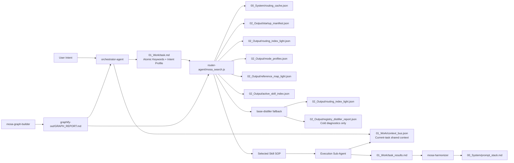

# MOSA Workspace Graph Report

## God Nodes

- `00_System/`: long-term workspace memory, state, and routing cache.
- `01_Work/`: active task pointers, intent profile, session state, and context bus.
- `02_Output/`: generated reports and durable outputs.
- `{SKILL_ROOT}/router-agent/`: intelligent skill routing.
- `{SKILL_ROOT}/base-distiller/`: read-only registry diagnostics.
- `{SKILL_ROOT}/mosa-harmonizer/`: framework alignment and memory sync.
- `{SKILL_ROOT}/mosa-graph-builder/`: topology and Token Shield generation.

## Mermaid Topology

## Token Shield Rule

- Prefer `00_System/mosa_cli.js start --mode ask` for lightweight startup.
- Read this graph before scanning workspace architecture.
- Use God Nodes to bound search.
- Prefer pointer files over full content.
- Use `startup_manifest.json` and `routing_index_light.json` before full skill indexes.
- Never read `registry_distiller_report.json` during normal startup.
- Use `context_bus.json` for current-task Agent handoff, not long-term memory.

## Active Skill Routing

1. `00_System/routing_cache.json`
2. `00_System/mosa_cli.js`
3. `00_System/mosa_startup.js`
4. `02_Output/startup_manifest.json`
5. `02_Output/routing_index_light.json`
6. `02_Output/mode_profiles.json`
7. `02_Output/reference_map_light.json`
8. `02_Output/active_skill_index.json`
9. Skill skeleton
10. Full Skill file

## Current Efficiency Notes

- Router reads frontmatter, headings, and protocol lines only.
- Router writes high-confidence results into `routing_cache.json`.
- Registry Distiller emits hot startup manifest, warm routing indexes, and cold full diagnostics.
- `session_state.json` stores graph context as a pointer-level summary.
- `context_bus.json` stores current-task shared facts and Agent handoffs.
- Registry tag collisions are currently 0 after shard rebuild.
- New projects start from `00_System/MOSA_PROJECT_STARTUP_PROTOCOL.md`.
- Router now prefers `routing_index_light.json`, excludes reference skills from Top 3, and uses `mode_profiles.json` for deterministic boosts.
- `registry_distiller_report.json` is cold data and is forbidden during normal startup.

