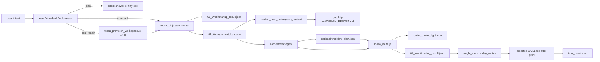

# MOSA Light Graph Report

## God Nodes

- `00_System/`: Node runtime tools for startup, routing, hooks, provision, promotion, and CLI checks.
- `01_Work/`: hot evidence and handoff files.
- `02_Output/`: warm indexes and cold diagnostics.
- `skills/`: public MOSA core skills.
- `graphify-out/GRAPH_REPORT.md`: first-read architecture pointer.

## Mermaid Topology

## Token Shield Rule

- Read this graph before broad architecture exploration.
- Read `01_Work/startup_result.json` and `01_Work/context_bus.json` before larger artifacts.
- Use `02_Output/routing_index_light.json` before full registry diagnostics.
- Treat `02_Output/registry_distiller_report.json` as cold diagnostics.
- Load full `SKILL.md` only after Router proof selects execution context.

## Current Efficiency Notes

- Startup proof: `01_Work/startup_result.json`
- Handoff and graph context: `01_Work/context_bus.json`
- DAG routing aid: `01_Work/workflow_plan.json`
- Router proof: `01_Work/routing_result.json`
- Warm routing index: `02_Output/routing_index_light.json`
- Cold diagnostics: `02_Output/registry_distiller_report.json`

## Startup Pointers

- CLI: `00_System/mosa_cli.js`
- Startup: `00_System/mosa_startup.js`
- Router: `00_System/mosa_route.js`
- Provision: `00_System/mosa_provision_workspace.js`
- Hook checks: `00_System/mosa_hooks.js`
